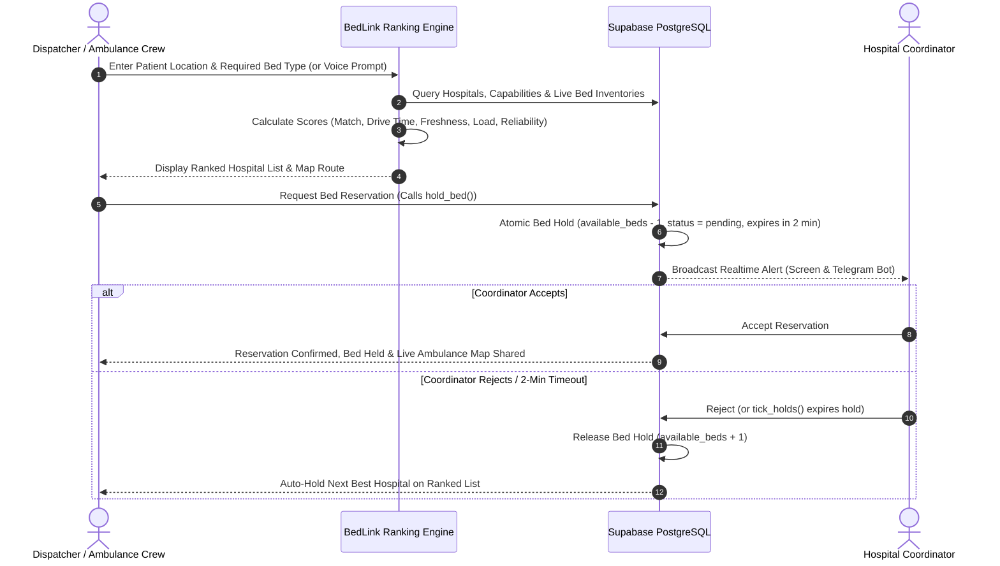

# BedLink

> **Find the nearest hospital with the right free bed, hold it for the ambulance, and move on to the next hospital automatically if the first one says no.**

Built for **Techforge 2026 (Healthtech Track)**. Mumbai pilot dataset: 19 real hospitals.

---

## Project Overview

Emergency medical services face a critical bottleneck: ambulance crews spending precious minutes calling hospitals or driving to facilities that lack available ICU, ventilator, or specialized emergency beds. BedLink solves this emergency triage challenge by providing:

1. **A 10-Second Bed-Update Screen for Ward Staff**: Nurses update free bed counts with single-tap controls on standard mobile web browsers or directly via Telegram text/voice notes.
2. **Intelligent Multi-Factor Dispatch Ranking**: Ranks hospitals by real road driving times, bed match capabilities, data freshness (showing exact age in minutes), and emergency room load.
3. **Atomic 2-Minute Reservation & Auto-Fallback**: Holds a matching bed atomically in the database (preventing double-booking across ambulances). If a hospital coordinator rejects or doesn't respond within 2 minutes, BedLink automatically holds the next-best hospital.
4. **Privacy-First Design**: Operates entirely with anonymized case IDs without storing or transmitting patient PII (personally identifiable information).

### Problem Statement & Brief Alignment

| Brief Requirement | BedLink Implementation |
| --- | --- |
| **Right Bed Match**: ICU, ventilator, oxygen, cardiac, burns | Supports 5 core bed types (ICU, Ventilator, Oxygen, Emergency Resus, General) + 5 medical specialties (Cardiac, Burns, Trauma, Neuro, Pediatric). |
| **10-Second Nurse Screen**: 1 tap per bed type on cheap phones | "Free beds right now" UI: every bed count on a single phone screen with large `−` / `+` buttons, instant `Saved in 0.3 s` toast feedback, and one-tap "All counts still correct" confirmation. Telegram text/voice updates included. |
| **Dispatch Ranking**: Bed match, travel time, freshness, load | Multi-factor weighting: 40% Bed Match, 25% Drive Time (real road routes via OSRM), 15% Data Freshness, 10% Hospital Load, 10% Hospital Reliability Score. |
| **2-Minute Hospital Response Window** | Request alert with live 2-minute countdown timer on coordinator screen and Telegram bot with inline Accept / Reject action buttons. |
| **Atomic Bed Hold** | Concurrency-safe atomic database transaction (`available_beds - 1 WHERE available_beds > 0`). Verified with 20 simultaneous concurrent hold requests (`npm run race-test`). |
| **Automated Fallback on Reject/Timeout** | Server/database clock (`pg_cron` / client tick fallback) handles expiration; dispatcher screen automatically transitions to hold the next-ranked hospital and records audit steps on a timeline. |
| **Data Freshness Indicators** | Every listing displays data freshness ("Updated 4 min ago") with color-coded badges (Green / Amber / Red). Freshness score decays over time to discourage stale listings. |

---

## Setup & Installation Instructions

### Prerequisites
- **Node.js**: `v20.x` or higher
- **npm**: `v10.x` or higher
- **Supabase Account / Database**: Local PostgreSQL or cloud Supabase project instance

### 1. Repository Installation

```bash
# Clone the repository
git clone https://github.com/swayamgode/T39-BedLink.git
cd T39-BedLink

# Install dependencies
npm install

# Prepare environment variables
cp .env.example .env.local
```

### Environment Configuration (`.env.local`)

| Variable | Description | Required |
| --- | --- | --- |
| `NEXT_PUBLIC_SUPABASE_URL` | Supabase Project URL | Required for live data |
| `NEXT_PUBLIC_SUPABASE_ANON_KEY` | Supabase Anonymous Key | Required for client auth & subscriptions |
| `SUPABASE_SERVICE_ROLE_KEY` | Supabase Service Role Secret Key | Server-only (used for account seeding & Telegram API) |
| `DEMO_USER_PASSWORD` | Password for generated demo accounts (min 8 chars) | Required for `npm run seed:users` |
| `SARVAM_API_KEY` | Sarvam AI API Key | Optional (enables voice intake & TTS) |
| `TELEGRAM_BOT_TOKEN` | Telegram Bot API Token from `@BotFather` | Optional (enables Telegram bot) |
| `TELEGRAM_BOT_USERNAME` | Telegram Bot Username | Optional (enables Telegram bot) |

> ⚠️ **Security Note**: Never expose `SUPABASE_SERVICE_ROLE_KEY` or `SARVAM_API_KEY` with a `NEXT_PUBLIC_` prefix or commit them to version control.

### 2. Database Migration & Schema Setup

Run the SQL migration files in your Supabase SQL Editor in the exact sequence specified below:

1. `supabase/migrations/20261002000000_bedlink_schema.sql`: Core schema (tables, enums, initial functions)
2. `supabase/seed.sql`: Initial seed data (**clears existing records**)
3. `supabase/setup_and_seed.sql`: Bed history and patient vitals handover schema
4. `supabase/migrations/20261002130000_role_based_access.sql`: Row-Level Security (RLS) policies (re-run whenever step 3 is run)
5. `supabase/migrations/20261002140000_add_procedures_performed.sql`: Medical procedure logging
6. `supabase/migrations/20261003000000_spec_features.sql`: Atomic hold (`hold_bed`), server clock (`tick_holds`), reliability scoring, diversion status
7. `supabase/migrations/20261003000100_more_mumbai_hospitals.sql`: Mumbai hospitals dataset expansion (19 hospitals total)
8. `supabase/migrations/20261003000200_free_care.sql`: Government & Maharashtrian 10% poor-patient quota classifications
9. `supabase/migrations/20261003000300_telegram_bot.sql`: Telegram integration schema & chat linkage

> 💡 **Background Server Clock Note**: Enable the `pg_cron` extension in Supabase (*Database → Extensions → pg_cron*) for server-side automatic hold expirations. If `pg_cron` is disabled, open client screens act as fallback clock runners.

### 3. Demo Account Provisioning & Server Launch

```bash
# Seed demo accounts (Admin, Dispatcher, Hospital Nurses & Coordinators)
npm run seed:users

# Start Next.js development server
npm run dev
```
Open `http://localhost:3000` in your web browser. 

> 🎤 **Voice Microphone Note**: Web Speech API / microphone access requires `localhost` or HTTPS. For testing mobile devices on local Wi-Fi, run `npx next dev --experimental-https`.

### 4. Optional Telegram Bot Setup

1. Request a bot token from `@BotFather` on Telegram and set `TELEGRAM_BOT_TOKEN` & `TELEGRAM_BOT_USERNAME` in `.env.local`.
2. **Local Environment**: Run long-polling alongside dev server:
   ```bash
   npm run telegram
   ```
3. **Production Deployment**: Configure webhook endpoint:
   ```bash
   npm run telegram:webhook -- https://your-deployment-domain.com
   ```
   Set up a scheduled cron worker to `POST` to `/api/telegram/nudge` every 60 seconds with header `X-BedLink-Cron` for automated "still right?" freshness checks.

---

## Key Features

- ⚡ **10-Second Mobile Nurse Workflow**: Designed for low-end mobile devices and rapid hospital ward updates. Instant save feedback with sub-second response times.
- 🎯 **Multi-Factor Dispatch Ranking**: Custom scoring algorithm balancing distance, drive time, capability match, load, data age, and hospital reliability.
- 🔒 **Atomic Concurrency-Safe Bed Locking**: Database-level stored procedure (`hold_bed`) guarantees zero double-booking when multiple ambulances request the last bed simultaneously.
- 🤖 **Telegram Bot for Ward Staff & Coordinators**: Staff can view/update bed counts via text or Hindi/Marathi/English voice messages. Coordinators receive interactive ambulance reservation alerts with inline Accept/Reject buttons.
- 🎙️ **Multilingual Voice Triage (Sarvam AI)**: Dispatchers can speak patient requirements ("ICU chahiye, ventilator bhi"); BedLink parses the prompt, filters hospitals, and responds audibly in Indian languages.
- 📊 **"Free on Arrival" Probability Estimation**: Statistical model estimating the likelihood of a bed remaining available upon ambulance arrival based on traffic, load, historical updates, and pending holds.
- 🔐 **Cryptographically Sealed Vitals Handover**: Pre-hospital vitals documentation signed with a SHA-256 integrity hash, enabling receiving hospitals to verify data wasn't tampered with en route.
- 🚨 **Mass Casualty / Disaster Dispatch Mode**: Distributes multiple casualties across nearby hospitals automatically based on capacity limits to prevent ER flooding.
- 🏥 **Free Care & Financial Triage Support**: Highlights public government hospitals and private hospitals offering 10% free bed quotas under Maharashtrian Healthcare regulations for low-income patients.
- 🗺️ **Live Road Distance & Ambulance Tracking**: Turn-by-turn road route generation via OSRM with live ETA and distance simulation on Leaflet maps.

---

## Technology Stack

| Layer | Technologies Used |
| --- | --- |
| **Framework & Engine** | Next.js 16 (App Router), Turbopack, React 19, TypeScript |
| **Styling & Icons** | Tailwind CSS 4, Lucide React Icons |
| **Database & Auth** | Supabase PostgreSQL, Supabase Auth (RBAC via `app_metadata`), Supabase Realtime (WebSockets), Row-Level Security (RLS) |
| **Routing & GIS Maps** | OSRM (Open Source Routing Machine) API, Leaflet, React-Leaflet, OpenStreetMap |
| **Voice & AI** | Sarvam AI API (Speech-to-Text, Translation, Text-to-Speech) |
| **Messaging Bot** | Telegram Bot API (Webhooks / Node.js polling) |
| **Form Handling & Validation** | React Hook Form, Zod |

---

## Architecture / Workflow

```
 Nurse / Coordinator (Phone / Telegram)          Dispatcher / Ambulance Crew
            │                                                 │
            │ Bed updates, Accept/Reject                      │ Patient triage intake, Hold bed
            ▼                                                 ▼
   ┌────────────────────────────── Supabase (PostgreSQL) ──────────────────────────────┐
   │                                                                                    │
   │  • hold_bed()  (Atomic row lock procedure)                                          │
   │  • tick_holds() (2-minute clock runner / pg_cron)                                  │
   │  • Row-Level Security (RLS) policies by user role                                  │
   │  • Realtime Engine: Broadcasts bed & reservation changes via WebSockets              │
   │                                                                                    │
   └────────────────────────────────────────────────────────────────────────────────────┘
            ▲                                                 ▲
            │                                                 │
   Telegram Bot Webhook                             OSRM Road Routing Engine
   & Cron Scheduler                                 & Sarvam AI Multilingual Voice
```

### Core Emergency Workflow



### Security & Role-Based Access Control (RBAC)

Security is enforced at three distinct layers:
1. **Next.js Proxy Middleware (`proxy.ts`)**: Validates session tokens and routes users according to role (`admin`, `dispatcher`, `nurse`, `coordinator`).
2. **API Route Handlers (`app/api/`)**: Verifies identity and hospital association prior to processing requests.
3. **Database Row-Level Security (RLS)**: Enforces access control in PostgreSQL policies using custom JWT claims stored in Supabase Auth `app_metadata`.

---

## Dataset / API Information

### Mumbai Hospital Dataset
The application includes a curated pilot dataset of **19 Mumbai hospitals**, covering real geographic coordinates, emergency contact information, bed capacities, medical capabilities, and financial care tiering.

- **Sample Hospitals Included**:
  - KEM Hospital (Parel) - *Public / Government*
  - Sion Hospital (Lokmanya Tilak Municipal General) - *Public / Government*
  - BYL Nair Charitable Hospital (Mumbai Central) - *Public / Government*
  - Lilavati Hospital (Bandra West) - *Private (10% Charity Quota)*
  - Sir H. N. Reliance Foundation Hospital (Girgaon) - *Private (10% Charity Quota)*
  - Bombay Hospital (Marine Lines) - *Private (10% Charity Quota)*
  - Nanavati Max Super Speciality Hospital (Vile Parle)
  - Fortis Hospital (Mulund)
  - Kokilaben Dhirubhai Ambani Hospital (Andheri West)
  - Additional regional hospitals across Dadar, Kurla, Chembur, and Thane.

### Application API Routes

| Endpoint | Method | Purpose | Access |
| --- | --- | --- | --- |
| `/api/beds/update` | `POST` | Update hospital bed inventory counts | Hospital Nurse / Coordinator |
| `/api/reservations/hold` | `POST` | Execute atomic bed reservation request | Dispatcher |
| `/api/reservations/respond` | `POST` | Accept or reject pending ambulance hold | Hospital Coordinator |
| `/api/hospitals` | `GET` | Fetch hospital listings and ranking calculations | Authenticated Users |
| `/api/voice/intake` | `POST` | Process Sarvam AI speech-to-text intake | Dispatcher |
| `/api/voice/speak` | `POST` | Generate text-to-speech audio for status updates | Dispatcher |
| `/api/telegram/webhook` | `POST` | Telegram Bot Webhook handler | Telegram Service |
| `/api/telegram/nudge` | `POST` | Trigger "Still right?" bed freshness notifications | Scheduled Cron |

### External APIs Integrated
- **OSRM Routing Engine (`router.project-osrm.org`)**: Driving route computation, travel distance (km), and real-time travel duration (mins).
- **Sarvam AI (`api.sarvam.ai`)**: Speech recognition (STT), translation, and voice synthesis (TTS) for Indian languages.
- **Telegram Bot API (`api.telegram.org`)**: Webhook delivery, push notifications, and inline button callback queries.

---

## Screenshots / Demo Information

### Application Screens & User Roles

| Role | Route | Primary Functions |
| --- | --- | --- |
| **Dispatcher / Crew** | `/` | Enter patient requirements, view ranked hospitals on map, hold beds, send sealed vitals, activate mass casualty mode |
| **Ward Nurse** | `/hospital` | Single-tap bed count management ("Free beds right now"), one-tap verification, Telegram pairing |
| **Hospital Coordinator** | `/hospital` | Receive reservation alerts, view 2-minute countdown timer, accept/reject requests, track incoming ambulance map |
| **Administrator** | `/` & `/history` | Switch hospital perspectives, test all screens, trigger automated demo flows, inspect audit log history |

### 3-Minute 3-Device Demo Walkthrough

To demonstrate BedLink in a live demo setting (e.g., using 3 mobile devices or browser tabs):

1. **Step 1 (Nurse Screen - `nurse.aditi@bedlink.test`)**: Tap `+` on ICU beds. The dispatcher's screen updates in real-time (< 1s) showing "Updated just now".
2. **Step 2 (Dispatcher Screen - `dispatcher@bedlink.test`)**: Select ICU + Ventilator requirements. Review the ranked hospital recommendations, drive times, and "Free on arrival" percentage. Tap **Hold bed (2 min)**.
3. **Step 3 (Coordinator Screen - `coordinator.aditi@bedlink.test`)**: The incoming reservation card appears with an active 2-minute countdown timer. Tap **Reject**. The dispatcher screen instantly updates and transitions to hold the next-best hospital automatically.
4. **Step 4 (Acceptance & Vitals Handover)**: Accept the subsequent request on the next hospital screen. Observe the live ambulance tracking map and open the sealed vitals card. Click **Verify Seal** to validate SHA-256 cryptographic integrity.
5. **Step 5 (Concurrency Verification)**: Run `npm run race-test` in the terminal to execute 20 simultaneous reservation attempts against a single remaining bed to demonstrate atomic locking.

### Executable Test Commands

```bash
# Development & Quality Assurance Scripts
npm run dev                  # Start Next.js development server
npm run build                # Run Next.js Turbopack production build
npm run lint                 # Run ESLint compliance check
npm run seed:users           # Reset & populate demo user accounts
npm run race-test            # Run concurrent stress test on bed locking logic
npm run telegram             # Run Telegram bot in local long-polling mode
npm run telegram:webhook     # Configure remote Telegram webhook URL
```

---

## Limitations & Future Scope

### Current Limitations
- **Simulated Ambulance Telemetry**: Live map movement currently simulates GPS positioning along the OSRM road route prior to active mobile GPS stream connection.
- **Browser Clock Fallback**: If Supabase `pg_cron` is not enabled on a custom host, automated hold expiration relies on active client browser sessions.
- **Demo Dataset Scope**: The pilot dataset covers 19 hospitals in Mumbai; full production deployment requires integration with local municipal healthcare APIs.
- **Static Telegram Link Tokens**: Telegram onboarding links generated on hospital screens use persistent tokens that should be restricted to authorized hospital staff.

### Future Scope
- 📱 **Native Mobile App for Paramedics**: Dedicated Android/iOS application with background location streaming and offline voice triage capability.
- 🏥 **ABDM & Hospital EHR Integration**: Direct integration with Ayushman Bharat Digital Mission (ABDM) and hospital electronic health record systems for automated bed status sync.
- 🔮 **Predictive AI Bed Availability**: Machine learning models to forecast bed availability based on historic emergency room traffic, time of day, and seasonal trends.
- 🌐 **Multi-Region Scaling**: Expanding coverage to additional metropolitan centers across India with multi-language dialect support.

---

## Team Members

**Team T39 - Techforge 2026 (Healthtech Track)**

- **Madhavan Chanda** (`madhu12-c`) — Full Stack Lead & System Architect
- **Swayam Gode** (`swayamgode`) — Frontend Engineer & Database Specialist

---
